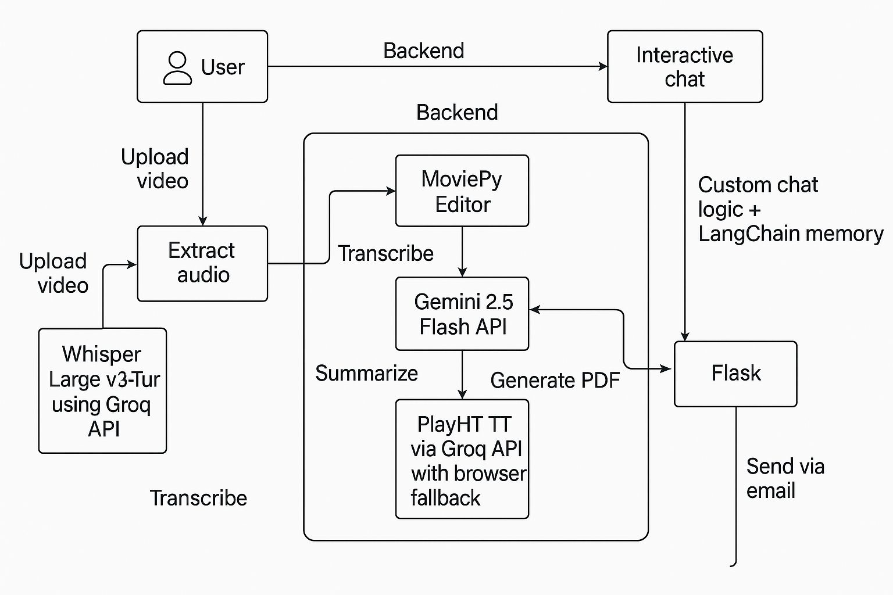

# ConverSync - Meeting Assistant

A comprehensive meeting assistant that automatically processes meeting recordings, generates transcripts, creates summaries, and emails minutes of the meeting to participants.

## Features

- **Convert Meeting Videos to Audio**  
  Upload a recorded meeting video, and the assistant will extract just the audio so it can be processed more efficiently.

- **Turn Speech into Text**  
  Automatically transcribes the spoken words from the audio into written text, making it easier to review and search through the conversation.

- **Read Aloud Responses**  
  The assistant can respond using a natural-sounding voice, allowing for a more interactive and accessible experience.

- **Summarize the Meeting**  
  Understands the full meeting conversation and generates a clear, organized summary with key points, decisions, and action items.

- **Ask Follow-up Questions**  
  Users can ask questions like “What were the main action items?” or “Who discussed the deadline?” and receive accurate answers from the meeting content.

- **Create a PDF Summary**  
  Produces a polished and professional PDF document that includes all important meeting details for recordkeeping or sharing.

- **Send Summaries by Email**  
  Automatically emails the generated summary to selected participants, ensuring everyone stays informed.

- **Accessible Through a Web App**  
  Everything is available through a user-friendly website — no special software or installation required.

## System Architecture



## Tech Stack

| Feature                      | Technology / Tool                               |
|-----------------------------|--------------------------------------------------|
| Video to Audio Conversion   | Moviepy Editor                                   |
| Audio Transcription         | Whisper Large v3-Turbo using Groq API            |
| AI Summarization            | Gemini 2.5 Flash API                             |
| Text-to-Speech              | PlayAI TTS via Groq API with browser fallback    |
| PDF Generation              | ReportLab                                        |
| Email Integration           | SMTP Protocol Client                             |
| Interactive Chat            | Gemini API                                       |
| Chat Memory                 | LangChain ConversationBufferMemory               |
| RESTful API                 | Flask                                            |
| Frontend                    | React.js                                         |
| CSS                         | Tailwind                                         |
| Animation                   | Framer-Motion                                    |
| Containerization            | Docker                                           |


## Project Structure

```
conversync/
├── api/
│   ├── __init__.py
│   ├── flask_app.py          # Flask web API
│   └── meeting_assistant.py  # Main orchestrator class
├── config/
│   ├── __init__.py
│   └── settings.py           # Configuration management
├── services/
│   ├── __init__.py
│   ├── media_converter.py    # Video/audio conversion
│   ├── transcription_service.py  # Audio transcription
│   ├── summarization_service.py  # AI summarization
│   ├── tts_service.py        # Text-to-Speech with Groq TTS
│   ├── pdf_service.py        # PDF generation
│   └── email_service.py      # Email functionality
├── frontend/                 # React frontend with TypeScript
│   ├── src/
│   │   ├── components/       # React components
│   │   ├── services/         # API service layer
│   │   ├── types/           # TypeScript type definitions
│   │   ├── App.tsx          # Main React application
│   │   └── main.tsx         # React entry point
│   ├── dist/                # Built frontend assets (auto-generated)
│   ├── package.json         # Node.js dependencies
│   ├── vite.config.ts       # Vite configuration
│   └── tailwind.config.js   # Tailwind CSS configuration
├── uploads/                  # Upload directory (created automatically)
├── outputs/                  # Output directory (created automatically)
├── temp/                     # Temporary files & TTS audio (created automatically)
├── .env                      # Environment variables
├── .env.example              # Environment variables template
├── requirements.txt          # Python dependencies
├── setup.bat                 # Windows setup script
├── setup.sh                  # Unix/Linux setup script
├── example_usage.py          # Usage examples
└── README.md                 # This file
```

## Installation

### Option 1: Docker (Recommended)

The easiest way to run ConverSync is using Docker. This method handles all dependencies automatically and ensures consistent behavior across different systems.

**Prerequisites:**
- Docker Desktop (Windows/Mac) or Docker Engine (Linux)
- Docker Compose

**Quick Start:**
```bash
# Clone the repository
git clone <repository-url>
cd conversync

# Run the setup script
# Windows:
docker-setup.bat

# Unix/Linux/Mac:
chmod +x docker-setup.sh
./docker-setup.sh
```

**Manual Docker Setup:**
```bash
# Create environment file
cp .env.example .env
# Edit .env with your API keys

# Build and start the application
docker-compose up --build

# Access the application at http://localhost:5000
```

**Development Mode:**
```bash
# For development with hot reload
docker-compose -f docker-compose.yml -f docker-compose.dev.yml up --build
```

For detailed Docker instructions, see [DOCKER.md](DOCKER.md).

### Option 2: Traditional Setup

1. **Clone the repository**:
   ```bash
   git clone <repository-url>
   cd conversync
   ```

2. **Quick Setup (Recommended)**:
   
   **Windows:**
   ```cmd
   setup.bat
   ```
   
   **Unix/Linux/Mac:**
   ```bash
   chmod +x setup.sh
   ./setup.sh
   ```

3. **Manual Setup**:

   **Backend Dependencies:**
   ```bash
   pip install -r requirements.txt
   ```

   **Frontend Dependencies:**
   ```bash
   cd frontend
   npm install
   npm run build
   cd ..
   ```

4. **Set up environment variables**:
   - Copy `.env.example` to `.env`
   - Fill in your API keys and email configuration:
   ```bash
   cp .env.example .env
   ```

5. **Configure your `.env` file**:
   ```env
   # API Keys
   GROQ_API_KEY=your_groq_api_key_here
   GEMINI_API_KEY=your_gemini_api_key_here

   # Email Configuration
   SMTP_SERVER=smtp.gmail.com
   SMTP_PORT=587
   SENDER_EMAIL=your_email@gmail.com
   SENDER_NAME=conversync
   APP_PASSWORD=your_app_password_here

   # Other settings...
   ```

## API Keys Setup

### Groq API Key
1. Visit [Groq Console](https://console.groq.com/)
2. Sign up/login and create an API key
3. Add it to your `.env` file as `GROQ_API_KEY`

### Google Gemini API Key
1. Visit [Google AI Studio](https://makersuite.google.com/app/apikey)
2. Create a new API key
3. Add it to your `.env` file as `GEMINI_API_KEY`

### Gmail App Password
1. Enable 2-factor authentication on your Gmail account
2. Generate an app password: [Google Account Settings](https://myaccount.google.com/apppasswords)
3. Add it to your `.env` file as `APP_PASSWORD`

## Usage

### As a Python Module

```python
from api.meeting_assistant import MeetingAssistant

# Initialize the assistant
assistant = MeetingAssistant()

# Process a video file
results = assistant.process_meeting_recording(
    video_file_path="meeting.mp4",
    recipients=["user1@example.com", "user2@example.com"],
    meeting_title="Weekly Standup",
    meeting_date="2024-01-15",
    company_name="Your Company"
)

print(f"Success: {results['success']}")
print(f"PDF generated: {results['pdf_file']}")
```

### As a Web API

1. **Start the Flask server**:
   ```bash
   python api/flask_app.py
   ```

2. **API Endpoints**:

   **Core Processing:**
   - **Health Check**: `GET /health`
   - **Process Video**: `POST /process-video`
   - **Process Audio**: `POST /process-audio`
   - **Process Transcript**: `POST /process-transcript`
   - **Transcribe Only**: `POST /transcribe-only`
   - **Download File**: `GET /download/<filename>`
   - **Supported Formats**: `GET /supported-formats`

   **Interactive Chat:**
   - **Start Chat**: `POST /chat/start`
   - **Send Message**: `POST /chat/<session_id>/message`
   - **Generate PDF**: `POST /chat/<session_id>/generate-minutes`
   - **Send Email**: `POST /chat/<session_id>/send-email`
   - **Text-to-Speech**: `POST /chat/<session_id>/tts`

3. **Example API Usage**:

   ```bash
   # Process a video file
   curl -X POST \
     -F "video_file=@meeting.mp4" \
     -F "recipients=user1@example.com,user2@example.com" \
     -F "meeting_title=Weekly Standup" \
     -F "meeting_date=2024-01-15" \
     http://localhost:5000/process-video
   ```

   ```bash
   # Process raw transcript
   curl -X POST \
     -H "Content-Type: application/json" \
     -d '{
       "transcript": "Meeting transcript text here...",
       "recipients": ["user1@example.com", "user2@example.com"],
       "meeting_title": "Budget Review",
       "meeting_date": "2024-01-15"
     }' \
     http://localhost:5000/process-transcript
   ```

### Interactive Web Interface

ConverSync now features a modern React-based web interface with real-time chat capabilities:

1. **Start the server**:
   ```bash
   python api/flask_app.py
   ```

2. **Access the web interface**:
   ```
   http://localhost:5000
   ```

3. **Features**:
   - **Modern React UI**: Built with TypeScript, Tailwind CSS, and Framer Motion
   - **File Upload**: Drag-and-drop support for video and audio files
   - **Real-time Processing**: Live progress indicators during transcription
   - **Interactive Chat**: Ask questions about meeting content with AI responses
   - **Voice Features**: Text-to-speech responses using high-quality Groq TTS
   - **PDF Generation**: Create and download professional meeting minutes
   - **Email Integration**: Send meeting minutes directly to participants
   - **Responsive Design**: Works seamlessly on desktop and mobile devices

4. **Development Mode** (for frontend development):
   ```bash
   # Terminal 1: Start backend
   python api/flask_app.py
   
   # Terminal 2: Start frontend dev server with hot reload
   cd frontend
   npm run dev
   # Access at http://localhost:3000
   ```

## API Reference

### Process Video Recording
**POST** `/process-video`

Process a video file to generate meeting minutes.

**Form Data:**
- `video_file` (file): Video file (MP4, AVI, MOV, MKV, WMV)
- `recipients` (string): Comma-separated email addresses
- `meeting_title` (string, optional): Meeting title
- `meeting_date` (string, optional): Meeting date
- `company_name` (string, optional): Company name for PDF header
- `custom_message` (string, optional): Custom email message

**Response:**
```json
{
  "success": true,
  "video_file": "/path/to/video.mp4",
  "audio_file": "/path/to/audio.mp3",
  "transcript_file": "/path/to/transcript.txt",
  "pdf_file": "/path/to/minutes.pdf",
  "email_sent": true,
  "processing_time": 45.67
}
```

### Process Audio File
**POST** `/process-audio`

Process an audio file to generate meeting minutes.

**Form Data:**
- `audio_file` (file): Audio file (MP3, WAV, FLAC, M4A, OGG, WEBM)
- `recipients` (string): Comma-separated email addresses
- `meeting_title` (string, optional): Meeting title
- `meeting_date` (string, optional): Meeting date
- `company_name` (string, optional): Company name for PDF header
- `custom_message` (string, optional): Custom email message

### Process Transcript Text
**POST** `/process-transcript`

Process raw transcript text to generate meeting minutes.

**JSON Body:**
```json
{
  "transcript": "Meeting transcript text...",
  "recipients": ["user1@example.com", "user2@example.com"],
  "meeting_title": "Optional meeting title",
  "meeting_date": "Optional meeting date",
  "company_name": "Optional company name",
  "custom_message": "Optional custom message"
}
```

### Transcribe Only
**POST** `/transcribe-only`

Transcribe audio/video file without generating summary.

**Form Data:**
- `video_file` OR `audio_file` (file): Media file to transcribe

**Response:**
```json
{
  "success": true,
  "transcript": "Transcribed text...",
  "language": "en",
  "duration": 123.45,
  "output_file": "/path/to/transcript.txt"
}
```

### Interactive Chat Endpoints

**POST** `/chat/start`

Start a new chat session with a transcript.

**JSON Body:**
```json
{
  "transcript": "Meeting transcript text..."
}
```

**Response:**
```json
{
  "success": true,
  "session_id": "unique-session-id",
  "message": "Chat session started successfully"
}
```

**POST** `/chat/<session_id>/message`

Send a message to the chat session.

**JSON Body:**
```json
{
  "message": "What were the main action items?"
}
```

**Response:**
```json
{
  "success": true,
  "response": "The main action items were..."
}
```

**POST** `/chat/<session_id>/tts`

Convert text to speech using Groq TTS.

**JSON Body:**
```json
{
  "text": "Text to convert to speech"
}
```

**Response:**
```json
{
  "success": true,
  "audio_url": "/temp/audio_file.mp3"
}
```

**POST** `/speech-to-text`

Convert speech to text using Groq Whisper.

**Form Data:**
- `audio` (file): Audio file (WAV, MP3, etc.)

**Response:**
```json
{
  "success": true,
  "text": "Transcribed text from audio"
}
```

## Services Overview

### MediaConverter
- Convert video files to audio
- Support for multiple video formats
- Get video information (duration, size, etc.)

### TranscriptionService
- Transcribe audio using Groq's Whisper API
- Support for multiple audio formats
- Batch transcription capabilities

### SummarizationService
- Generate structured meeting summaries using Gemini AI
- Extract participants, decisions, action items
- Custom summarization prompts

### TTSService
- High-quality text-to-speech using Groq TTS API
- Automatic file cleanup and session management
- Fallback to browser speech synthesis
- Support for multiple voice models

### PDFService
- Create professional meeting minutes PDFs
- Customizable headers and company branding
- Multi-page support with pagination

### EmailService
- Send emails with PDF attachments
- Customizable email templates
- Support for multiple recipients

## Configuration

All configuration is managed through environment variables and the `Config` class in `config/settings.py`. Key settings include:

- **API Keys**: Groq and Gemini API keys
- **Email Settings**: SMTP configuration
- **File Paths**: Upload, output, and temporary directories
- **Model Settings**: AI model selection for transcription, TTS, and summarization
- **PDF Settings**: Company branding options
- **TTS Settings**: Voice model selection and audio quality

## Error Handling

The application includes comprehensive error handling:
- Invalid file formats
- Missing API keys
- Network connectivity issues
- File processing errors
- Email delivery failures

## Development

### Frontend Development
The React frontend is built with modern tools and practices:

- **React 18** with TypeScript for type safety
- **Vite** for fast development and building
- **Tailwind CSS** for utility-first styling
- **Framer Motion** for smooth animations
- **Lucide React** for consistent icons

**Development Commands:**
```bash
cd frontend

# Install dependencies
npm install

# Start development server (with hot reload)
npm run dev

# Build for production
npm run build

# Lint code
npm run lint
```

### Backend Development
The Flask backend provides REST API endpoints and handles all AI processing:

**Development Server:**
```bash
python api/flask_app.py
```

**Running Tests:**
```bash
python example_usage.py
```

### Architecture
- **Frontend**: React SPA that communicates with backend via REST API
- **Backend**: Flask server handling file processing, AI interactions, and session management
- **API Layer**: RESTful API with clear separation between frontend and backend
- **Development Proxy**: Vite dev server proxies API calls to Flask backend during development

## Supported File Formats

### Video Files
- MP4, AVI, MOV, MKV, WMV

### Audio Files
- MP3, WAV, FLAC, M4A, OGG, WEBM

## Limitations
- Maximum file size: 500MB
- Video processing requires sufficient disk space
- API rate limits apply to external services
- Email sending requires proper SMTP configuration

## Contributing

1. Fork the repository
2. Create a feature branch
3. Make your changes
4. Add tests if applicable
5. Submit a pull request

## License

This project is licensed under the MIT License.

## Support

For issues and questions:
1. Check the configuration in your `.env` file
2. Verify API keys are valid
3. Check network connectivity
4. Review log outputs for specific error messages
